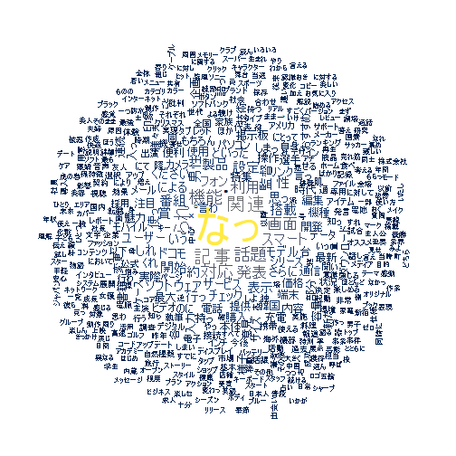
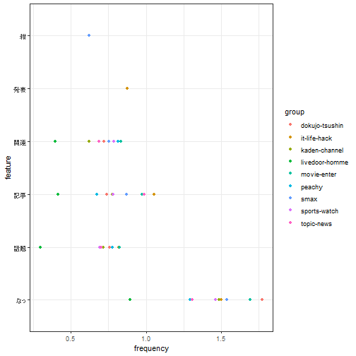
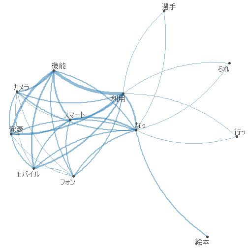
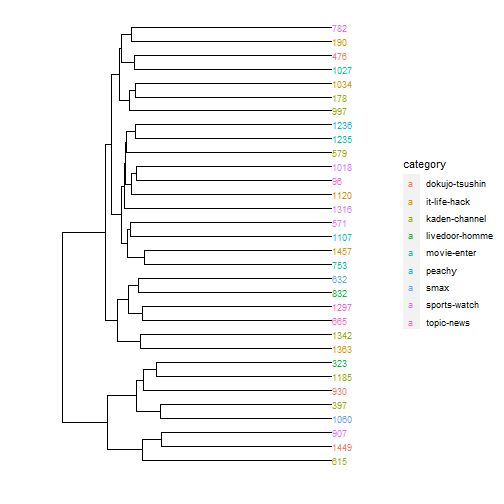
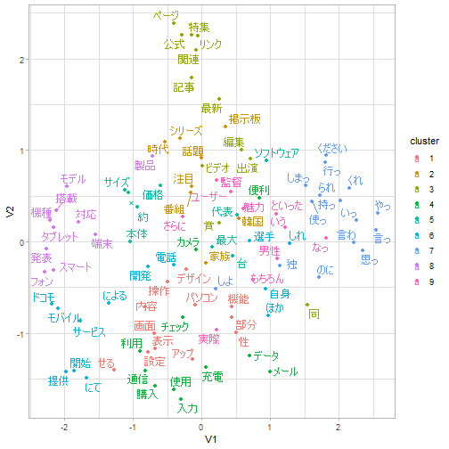

# R（quanteda）によるテキスト解析

## この記事について

[quanteda](https://github.com/quanteda/quanteda)と[RcppMeCab](https://zenn.dev/paithiov909/articles/4777d371178aa7b98b4e)を用いたテキストマイニングの例です（[googledrive](https://github.com/tidyverse/googledrive)を利用して自作の文章を分析していた過去記事については[Qiitaのログ](https://qiita.com/paithiov909/items/a47a097836e8a9ec12ef/revisions)（revision < 10）から参照してください）。

なお、以下のパッケージについては、ここではGitHubからインストールできるものを使っています。

- [paithiov909/audubon](https://github.com/paithiov909/audubon)
- [paithiov909/ldccr](https://github.com/paithiov909/ldccr)
- [paithiov909/RcppMeCab](https://github.com/paithiov909/RcppMeCab)

こういう使い方ができるというメモのようなもので、やっていることの意味についての説明はしていません。また、quantedaは[tokenizers](https://github.com/ropensci/tokenizers)をラップした関数によって日本語の文書でも分かち書きできるので、手元の辞書に収録されている表現どおりに分かち書きしたい場合や、品詞情報が欲しい場合でないかぎりは、形態素解析器を使うメリットはあまりないかもしれません。tokenizers（内部的にはstringi）が利用しているICUの[Boundary Analysis](https://unicode-org.github.io/icu/userguide/boundaryanalysis/)の仕様については、[UAX#29](https://www.unicode.org/reports/tr29/#Word_Boundaries)などを参照してください。

---

## データの準備

テキストデータとして[livedoorニュースコーパス](https://www.rondhuit.com/download.html#ldcc)を使います。以下の9カテゴリです。

- トピックニュース
- Sports Watch
- ITライフハック
- 家電チャンネル
- MOVIE ENTER
- 独女通信
- エスマックス
- livedoor HOMME
- Peachy

[ldccr](https://github.com/paithiov909/ldccr)でデータフレームにします。


```r
data <- ldccr::read_ldnws(exdir = "cache")
#> Parsing dokujo-tsushin...
#> Parsing it-life-hack...
#> Parsing kaden-channel...
#> Parsing livedoor-homme...
#> Parsing movie-enter...
#> Parsing peachy...
#> Parsing smax...
#> Parsing sports-watch...
#> Parsing topic-news...
#> Done.
```

このうち一部だけをquantedaのコーパスオブジェクトとして格納し、いろいろ試していきます。このとき、あらかじめ`■`という文字だけ取り除いておきます。


```r
corp <- data %>%
  dplyr::sample_frac(size = .2)

corp <- corp %>%
  dplyr::pull("body") %>%
  stringr::str_remove_all("[\u25a0]+") %>%
  audubon::strj_normalize() %>%
  RcppMeCab::posParallel(format = "data.frame") %>%
  tidyr::drop_na() %>%
  audubon::pack() %>%
  dplyr::bind_cols(corp) %>%
  quanteda::corpus()
```

## ワードクラウド

ストップワードとして`rtweet::stopwordslangs`を利用しています。


```r
stopwords <- rtweet::stopwordslangs %>%
  dplyr::filter(lang == "ja") %>%
  dplyr::filter(p >= .98) %>%
  dplyr::pull(word)

corp %>%
  quanteda::tokens(what = "fastestword", remove_punct = TRUE) %>%
  quanteda::tokens_remove(stopwords, valuetype = "fixed") %>%
  quanteda::dfm() %>%
  quanteda::dfm_group(groups = category) %>%
  quanteda::dfm_trim(min_termfreq = 10L) %>%
  quanteda.textplots::textplot_wordcloud(color = viridis::cividis(8L))
```



## 出現頻度の集計


```r
corp %>%
  quanteda::tokens(what = "fastestword", remove_punct = TRUE) %>%
  quanteda::tokens_remove(stopwords, valuetype = "fixed") %>%
  quanteda::dfm() %>%
  quanteda::dfm_weight("prop") %>%
  quanteda.textstats::textstat_frequency(groups = category) %>%
  dplyr::top_n(-30L, rank) %>%
  ggpubr::ggdotchart(
    x = "feature",
    y = "frequency",
    group = "group",
    color = "group",
    rotate = TRUE
  ) +
  ggplot2::theme_bw()
```



## Keyness

ITライフハック（`it-life-hack`）グループの文書とその他の対照を見ています。


```r
corp %>%
  quanteda::tokens(what = "fastestword", remove_punct = TRUE) %>%
  quanteda::tokens_remove(stopwords, valuetype = "fixed") %>%
  quanteda::dfm() %>%
  quanteda::dfm_group(groups = category) %>%
  quanteda.textstats::textstat_keyness(target = "it-life-hack") %>%
  quanteda.textplots::textplot_keyness()
```


## 対応分析

全部をプロットすると潰れて見えないので一部だけを抽出しています。


```r
corp_sample <- quanteda::corpus_sample(corp, size = 32L)
corp_sample %>%
  quanteda::tokens(what = "fastestword", remove_punct = TRUE) %>%
  quanteda::tokens_remove(stopwords, valuetype = "fixed") %>%
  quanteda::dfm() %>%
  quanteda::dfm_weight(scheme = "prop") %>%
  quanteda.textmodels::textmodel_ca() %>%
  quanteda.textplots::textplot_scale1d(
    margin = "documents",
    groups = quanteda::docvars(corp_sample, "category")
  )
```


## 共起ネットワーク

共起ネットワークもあまり大きな文書集合だと潰れて見えないので、対応分析と同じコーパスについて描画してみます。


```r
corp_sample %>%
  quanteda::tokens(what = "fastestword", remove_punct = TRUE) %>%
  quanteda::tokens_remove(stopwords, valuetype = "fixed") %>%
  quanteda::dfm() %>%
  quanteda::dfm_group(groups = category) %>%
  quanteda::dfm_trim(min_termfreq = 20L) %>%
  quanteda::fcm() %>%
  quanteda.textplots::textplot_network()
```



## クラスタリング

マンハッタン距離、ward法（ward.D2）です。ここでも一部だけを抽出しています。


```r
d <- corp_sample %>%
  quanteda::tokens(what = "fastestword", remove_punct = TRUE) %>%
  quanteda::tokens_remove(stopwords, valuetype = "fixed") %>%
  quanteda::dfm() %>%
  quanteda::dfm_weight(scheme = "prop") %>%
  quanteda.textstats::textstat_dist(method = "manhattan") %>%
  as.dist() %>%
  hclust(method = "ward.D2") %>%
  ggdendro::dendro_data(type = "rectangle") %>%
  purrr::list_modify(
    labels = dplyr::bind_cols(
      .$labels,
      names = names(corp_sample),
      category = quanteda::docvars(corp_sample, "category")
    )
  )

ggplot2::ggplot(ggdendro::segment(d)) +
  ggplot2::geom_segment(aes(x = x, y = y, xend = xend, yend = yend)) +
  ggplot2::geom_text(ggdendro::label(d), mapping = aes(x, y, label = names, colour = category, hjust = 0), size = 3) +
  ggplot2::coord_flip() +
  ggplot2::scale_y_reverse(expand = c(.2, 0)) +
  ggdendro::theme_dendro()
```



## LDA（Latent Dirichlet Allocation）

LDAについては`quanteda::convert`でdfmを変換して`topicmodels::LDA`に直接渡すこともできます。公式の[クイックスタートガイド](https://quanteda.io/articles/pkgdown/quickstart_ja.html#topic-models)も参考にしてください。weighted LDAなどの実装を含む[keyATM](https://github.com/keyATM/keyATM)といった選択肢もあります。

なお、トピック数は9に決め打ちしています。トピック数含めパラメタの探索をしたい場合には、[ldatuning](https://github.com/nikita-moor/ldatuning)や[stm](https://github.com/bstewart/stm)などを利用したほうがよいです。


```r
dtm <- corp %>%
  quanteda::tokens(what = "fastestword", remove_punct = TRUE) %>%
  quanteda::tokens_remove(stopwords, valuetype = "fixed") %>%
  quanteda::dfm() %>%
  quanteda::dfm_tfidf()

features <- corp %>%
  quanteda::tokens(what = "fastestword", remove_punct = TRUE) %>%
  quanteda::tokens_remove(stopwords, valuetype = "fixed") %>%
  quanteda::dfm() %>%
  quanteda::ntoken()

m <- dtm %>%
  as("dgCMatrix") %>%
  textmineR::FitLdaModel(k = 9, iterations = 200, burnin = 175)

m$phi %>%
  textmineR::GetTopTerms(15L) %>%
  knitr::kable()
```


|t_1    |t_2        |t_3        |t_4          |t_5        |t_6            |t_7          |t_8      |t_9      |
|:------|:----------|:----------|:------------|:----------|:--------------|:------------|:--------|:--------|
|男性   |孫         |空港       |肌           |賞         |ビデオ         |ソフトウェア |選手     |韓国     |
|転職   |八重歯     |マリリン   |当選         |主演       |ちょろ         |ドコモ       |掲示板   |ロゴ     |
|独     |自転車     |人類       |チョコレート |アカデミー |話題           |表示         |試合     |年収     |
|紺     |ゴルフ     |展         |アイテム     |監督       |録画           |画面         |番組     |企業     |
|占い   |クルマ     |剛力       |韓国         |篇         |書籍           |機能         |代表     |調査     |
|思っ   |歯         |キャプテン |化粧         |アクション |トイレ         |対応         |アナ     |事業     |
|夫婦   |釣れ       |体操       |香り         |ストーリー |売れ筋         |スマート     |批判     |カフェ   |
|離婚   |社長       |レンタル   |クリスマス   |演じる     |電子           |フォン       |香川     |購入     |
|友人   |ねこ       |宇宙       |クリーム     |女優       |ソニー         |搭載         |発言     |イオン   |
|夫     |ブータン   |ホルダー   |ケア         |役         |カメラ         |利用         |銃       |診断     |
|すごく |ゴルファー |カーター   |美容         |最強       |プロジェクター |端末         |サッカー |東口     |
|浮気   |金子       |はや       |痔           |ナイト     |家電           |機種         |監督     |前年     |
|求人   |自殺       |アメリカ   |賞品         |受賞       |レンズ         |設定         |なでしこ |ショップ |
|悩み   |家計       |嶋         |ファッション |主人公     |ローラ         |パソコン     |五輪     |店舗     |
|デート |スキー     |ジョン     |発送         |★         |カセット       |操作         |芸能     |増       |

LDAvisで可視化してみます。ただ、LDAvisはもうしばらくメンテナンスされていないパッケージで、ちょっと挙動があやしいところがあります。たとえば、デフォルトロケールがCP932であるWindows環境の場合、`LDAvis::createJSON`で書き出されるラベル（vocab）のエンコーディングがそっちに引きずられてCP932になってしまうため、ブラウザで表示したときにラベルが文字化けします。書き出されたlda.jsonをUTF-8に変換すれば文字化けは解消されるので、とりあえずあとから変換して上書きするとよいです。


```r
suppressWarnings({
  LDAvis::createJSON(
    phi = m$phi,
    theta = m$theta,
    doc.length = features,
    vocab = stringi::stri_enc_toutf8(dtm@Dimnames$features),
    term.frequency = quanteda::colSums(dtm)
  ) %>%
    LDAvis::serVis(open.browser = FALSE, out.dir = file.path(getwd(), "cache/ldavis"))
})

readr::read_lines_raw(file.path(getwd(), "cache/ldavis", "lda.json")) %>%
  iconv(from = "CP932", to = "UTF-8") %>%
  jsonlite::parse_json(simplifyVector = TRUE) %>%
  jsonlite::write_json(file.path(getwd(), "cache/ldavis", "lda.json"), dataframe = "columns", auto_unbox = TRUE)
```


> [LDAvis](https://paithiov909.github.io/nlp-using-r/ldavis/index.html)

## GloVe

ここでは50次元の埋め込みを得ます。


```r
toks <- corp %>%
  quanteda::tokens(what = "fastestword", remove_punct = TRUE) %>%
  as.list() %>%
  text2vec::itoken()

vocab <- toks %>%
  text2vec::create_vocabulary() %>%
  text2vec::prune_vocabulary(term_count_min = 10L)

vectorize <- text2vec::vocab_vectorizer(vocab)

tcm <- text2vec::create_tcm(
  it = toks,
  vectorizer = vectorize,
  skip_grams_window = 5L
)

glove <- text2vec::GlobalVectors$new(
  rank = 50,
  x_max = 15L
)

wv <- glove$fit_transform(
  x = tcm,
  n_iter = 10L
) %>%
  as.data.frame(stringsAsFactors = FALSE) %>%
  tibble::as_tibble(.name_repair = "minimal", rownames = NA)
#> INFO  [06:08:25.713] epoch 1, loss 0.1638 
#> INFO  [06:08:27.052] epoch 2, loss 0.0967 
#> INFO  [06:08:28.321] epoch 3, loss 0.0816 
#> INFO  [06:08:29.572] epoch 4, loss 0.0723 
#> INFO  [06:08:30.869] epoch 5, loss 0.0658 
#> INFO  [06:08:32.134] epoch 6, loss 0.0610 
#> INFO  [06:08:33.387] epoch 7, loss 0.0572 
#> INFO  [06:08:34.682] epoch 8, loss 0.0543 
#> INFO  [06:08:35.936] epoch 9, loss 0.0518 
#> INFO  [06:08:37.187] epoch 10, loss 0.0497
```

[umap](https://github.com/tkonopka/umap)で次元を減らして可視化します。色は`stats::kmeans`でクラスタリング（コサイン類似度）して付けています。


```r
pull_layout <- function(tbl) {
  umap <- umap::umap(as.matrix(tbl))
  layout <- umap$layout
  rownames(layout) <- rownames(tbl)
  return(as.data.frame(layout))
}

vec <- vocab %>%
  dplyr::anti_join(
    y = tibble::tibble(words = stopwords),
    by = c("term" = "words")
  ) %>%
  dplyr::arrange(desc(term_count)) %>%
  dplyr::slice_head(n = 100L) %>%
  dplyr::left_join(tibble::rownames_to_column(wv), by = c("term" = "rowname")) %>%
  tibble::column_to_rownames("term") %>%
  dplyr::select(starts_with("V"))

dist <- proxyC::simil(as(as.matrix(vec), "dgCMatrix"), method = "cosine")
clust <- kmeans(x = dist, centers = 9)
vec <- pull_layout(vec) %>%
  tibble::rownames_to_column() %>%
  dplyr::mutate(cluster = as.factor(clust$cluster))

vec %>%
  ggplot2::ggplot(aes(x = V1, y = V2, colour = cluster)) +
  ggplot2::geom_point() +
  ggrepel::geom_text_repel(aes(label = rowname)) +
  ggplot2::theme_light()
```



## セッション情報


```r
sessioninfo::session_info()
#> - Session info -----------------------------------------------------------------------
#>  setting  value
#>  version  R version 4.1.2 (2021-11-01)
#>  os       Windows 10 x64 (build 19043)
#>  system   x86_64, mingw32
#>  ui       RStudio
#>  language (EN)
#>  collate  Japanese_Japan.932
#>  ctype    Japanese_Japan.932
#>  tz       Asia/Tokyo
#>  date     2022-03-03
#>  rstudio  2022.02.0+443 Prairie Trillium (desktop)
#>  pandoc   2.17.1.1 @ C:/Program Files/RStudio/bin/quarto/bin/ (via rmarkdown)
#> 
#> - Packages ---------------------------------------------------------------------------
#>  ! package             * version     date (UTC) lib source
#>    abind                 1.4-5       2016-07-21 [1] CRAN (R 4.1.1)
#>    askpass               1.1         2019-01-13 [1] CRAN (R 4.1.2)
#>    assertthat            0.2.1       2019-03-21 [1] CRAN (R 4.1.2)
#>    audubon               0.1.1       2022-02-14 [1] CRAN (R 4.1.2)
#>    backports             1.4.1       2021-12-13 [1] CRAN (R 4.1.2)
#>    bit                   4.0.4       2020-08-04 [1] CRAN (R 4.1.2)
#>    bit64                 4.0.5       2020-08-30 [1] CRAN (R 4.1.2)
#>    broom                 0.7.12      2022-01-28 [1] CRAN (R 4.1.2)
#>    cachem                1.0.6       2021-08-19 [1] CRAN (R 4.1.2)
#>    car                   3.0-12      2021-11-06 [1] CRAN (R 4.1.2)
#>    carData               3.0-5       2022-01-06 [1] CRAN (R 4.1.2)
#>    cli                   3.2.0       2022-02-14 [1] CRAN (R 4.1.2)
#>    coda                  0.19-4      2020-09-30 [1] CRAN (R 4.1.2)
#>    codetools             0.2-18      2020-11-04 [2] CRAN (R 4.1.2)
#>    colorspace            2.0-3       2022-02-21 [1] CRAN (R 4.1.2)
#>    crayon                1.5.0       2022-02-14 [1] CRAN (R 4.1.2)
#>    curl                  4.3.2       2021-06-23 [1] CRAN (R 4.1.2)
#>    data.table            1.14.2      2021-09-27 [1] CRAN (R 4.1.2)
#>    DBI                   1.1.2       2021-12-20 [1] CRAN (R 4.1.2)
#>    digest                0.6.29      2021-12-01 [1] CRAN (R 4.1.2)
#>    dplyr                 1.0.8       2022-02-08 [1] CRAN (R 4.1.2)
#>    ellipsis              0.3.2       2021-04-29 [1] CRAN (R 4.1.2)
#>    evaluate              0.15        2022-02-18 [1] CRAN (R 4.1.2)
#>    fansi                 1.0.2       2022-01-14 [1] CRAN (R 4.1.2)
#>    farver                2.1.0       2021-02-28 [1] CRAN (R 4.1.2)
#>    fastmap               1.1.0       2021-01-25 [1] CRAN (R 4.1.2)
#>    fastmatch             1.1-3       2021-07-23 [1] CRAN (R 4.1.1)
#>    float                 0.2-6       2021-09-20 [1] CRAN (R 4.1.1)
#>    foreach               1.5.2       2022-02-02 [1] CRAN (R 4.1.2)
#>    generics              0.1.2       2022-01-31 [1] CRAN (R 4.1.2)
#>    ggdendro              0.1.23      2022-02-16 [1] CRAN (R 4.1.2)
#>    ggplot2             * 3.3.5       2021-06-25 [1] CRAN (R 4.1.2)
#>    ggpubr                0.4.0       2020-06-27 [1] CRAN (R 4.1.2)
#>    ggrepel               0.9.1       2021-01-15 [1] CRAN (R 4.1.2)
#>    ggsignif              0.6.3       2021-09-09 [1] CRAN (R 4.1.2)
#>    glmnet                4.1-3       2021-11-02 [1] CRAN (R 4.1.2)
#>    glue                  1.6.2       2022-02-24 [1] CRAN (R 4.1.2)
#>    gridExtra             2.3         2017-09-09 [1] CRAN (R 4.1.2)
#>    gtable                0.3.0       2019-03-25 [1] CRAN (R 4.1.2)
#>    highr                 0.9         2021-04-16 [1] CRAN (R 4.1.2)
#>    hms                   1.1.1       2021-09-26 [1] CRAN (R 4.1.2)
#>    htmltools             0.5.2       2021-08-25 [1] CRAN (R 4.1.2)
#>    httpuv                1.6.5       2022-01-05 [1] CRAN (R 4.1.2)
#>    httr                  1.4.2       2020-07-20 [1] CRAN (R 4.1.2)
#>    iterators             1.0.14      2022-02-05 [1] CRAN (R 4.1.2)
#>    jsonlite              1.8.0       2022-02-22 [1] CRAN (R 4.1.2)
#>    knitr                 1.37        2021-12-16 [1] CRAN (R 4.1.2)
#>    labeling              0.4.2       2020-10-20 [1] CRAN (R 4.1.1)
#>    later                 1.3.0       2021-08-18 [1] CRAN (R 4.1.2)
#>    lattice               0.20-45     2021-09-22 [2] CRAN (R 4.1.2)
#>    LDAvis                0.3.2       2015-10-24 [1] CRAN (R 4.1.2)
#>    ldccr                 0.0.6.900   2022-02-05 [1] Github (paithiov909/ldccr@b23ef2f)
#>    lgr                   0.4.3       2021-09-16 [1] CRAN (R 4.1.2)
#>    LiblineaR             2.10-12     2021-03-02 [1] CRAN (R 4.1.2)
#>    lifecycle             1.0.1       2021-09-24 [1] CRAN (R 4.1.2)
#>    magrittr            * 2.0.2       2022-01-26 [1] CRAN (R 4.1.2)
#>    MASS                  7.3-54      2021-05-03 [2] CRAN (R 4.1.2)
#>    Matrix                1.3-4       2021-06-01 [2] CRAN (R 4.1.2)
#>    memoise               2.0.1       2021-11-26 [1] CRAN (R 4.1.2)
#>    mlapi                 0.1.0       2017-12-17 [1] CRAN (R 4.1.2)
#>    munsell               0.5.0       2018-06-12 [1] CRAN (R 4.1.2)
#>    network               1.17.1      2021-06-14 [1] CRAN (R 4.1.2)
#>    nsyllable             1.0.1       2022-02-28 [1] CRAN (R 4.1.2)
#>    openssl               1.4.6       2021-12-19 [1] CRAN (R 4.1.2)
#>    pillar                1.7.0       2022-02-01 [1] CRAN (R 4.1.2)
#>    pkgconfig             2.0.3       2019-09-22 [1] CRAN (R 4.1.2)
#>    png                   0.1-7       2013-12-03 [1] CRAN (R 4.1.1)
#>    promises              1.2.0.1     2021-02-11 [1] CRAN (R 4.1.2)
#>    proxy                 0.4-26      2021-06-07 [1] CRAN (R 4.1.2)
#>    proxyC                0.2.4       2021-12-10 [1] CRAN (R 4.1.2)
#>    purrr                 0.3.4       2020-04-17 [1] CRAN (R 4.1.2)
#>    quanteda              3.2.1       2022-03-01 [1] CRAN (R 4.1.2)
#>    quanteda.textmodels   0.9.4       2021-04-06 [1] CRAN (R 4.1.2)
#>    quanteda.textplots    0.94        2021-04-06 [1] CRAN (R 4.1.2)
#>    quanteda.textstats    0.95        2021-11-24 [1] CRAN (R 4.1.2)
#>    R.cache               0.15.0      2021-04-30 [1] CRAN (R 4.1.2)
#>    R.methodsS3           1.8.1       2020-08-26 [1] CRAN (R 4.1.1)
#>    R.oo                  1.24.0      2020-08-26 [1] CRAN (R 4.1.1)
#>    R.utils               2.11.0      2021-09-26 [1] CRAN (R 4.1.2)
#>    R6                    2.5.1       2021-08-19 [1] CRAN (R 4.1.2)
#>    Rcpp                  1.0.8       2022-01-13 [1] CRAN (R 4.1.2)
#>    RcppMeCab             0.0.1.3.900 2022-01-17 [1] local
#>  D RcppParallel          5.1.5       2022-01-05 [1] CRAN (R 4.1.2)
#>    RcppProgress          0.4.2       2020-02-06 [1] CRAN (R 4.1.2)
#>    readr                 2.1.2       2022-01-30 [1] CRAN (R 4.1.2)
#>    reticulate            1.24        2022-01-26 [1] CRAN (R 4.1.2)
#>    RhpcBLASctl           0.21-247.1  2021-11-05 [1] CRAN (R 4.1.2)
#>    RJSONIO               1.3-1.6     2021-09-16 [1] CRAN (R 4.1.1)
#>    rlang                 1.0.1       2022-02-03 [1] CRAN (R 4.1.2)
#>    rmarkdown             2.11        2021-09-14 [1] CRAN (R 4.1.2)
#>    rsparse               0.5.0       2021-11-30 [1] CRAN (R 4.1.2)
#>    RSpectra              0.16-0      2019-12-01 [1] CRAN (R 4.1.2)
#>    rstatix               0.7.0       2021-02-13 [1] CRAN (R 4.1.2)
#>    rstudioapi            0.13        2020-11-12 [1] CRAN (R 4.1.2)
#>    rtweet                0.7.0       2020-01-08 [1] CRAN (R 4.1.2)
#>    scales                1.1.1       2020-05-11 [1] CRAN (R 4.1.2)
#>    servr               * 0.24        2021-11-16 [1] CRAN (R 4.1.2)
#>    sessioninfo           1.2.2       2021-12-06 [1] CRAN (R 4.1.2)
#>    shape                 1.4.6       2021-05-19 [1] CRAN (R 4.1.1)
#>    sna                   2.6         2020-10-06 [1] CRAN (R 4.1.2)
#>    SparseM               1.81        2021-02-18 [1] CRAN (R 4.1.1)
#>    statnet.common        4.5.0       2021-06-05 [1] CRAN (R 4.1.2)
#>    stopwords             2.3         2021-10-28 [1] CRAN (R 4.1.2)
#>    stringi               1.7.6       2021-11-29 [1] CRAN (R 4.1.2)
#>    stringr               1.4.0       2019-02-10 [1] CRAN (R 4.1.2)
#>    styler                1.6.2       2021-09-23 [1] CRAN (R 4.1.2)
#>    survival              3.2-13      2021-08-24 [2] CRAN (R 4.1.2)
#>    text2vec              0.6         2020-02-18 [1] CRAN (R 4.1.2)
#>    textmineR             3.0.5       2021-06-28 [1] CRAN (R 4.1.2)
#>    tibble                3.1.6       2021-11-07 [1] CRAN (R 4.1.2)
#>    tidyr                 1.2.0       2022-02-01 [1] CRAN (R 4.1.2)
#>    tidyselect            1.1.2       2022-02-21 [1] CRAN (R 4.1.2)
#>    tzdb                  0.2.0       2021-10-27 [1] CRAN (R 4.1.2)
#>    umap                  0.2.7.0     2020-11-04 [1] CRAN (R 4.1.2)
#>    utf8                  1.2.2       2021-07-24 [1] CRAN (R 4.1.2)
#>    V8                    4.1.0       2022-02-06 [1] CRAN (R 4.1.2)
#>    vctrs                 0.3.8       2021-04-29 [1] CRAN (R 4.1.2)
#>    viridis               0.6.2       2021-10-13 [1] CRAN (R 4.1.2)
#>    viridisLite           0.4.0       2021-04-13 [1] CRAN (R 4.1.2)
#>    vroom                 1.5.7       2021-11-30 [1] CRAN (R 4.1.2)
#>    withr                 2.4.3       2021-11-30 [1] CRAN (R 4.1.2)
#>    xfun                  0.29        2021-12-14 [1] CRAN (R 4.1.2)
#>    yaml                  2.3.5       2022-02-21 [1] CRAN (R 4.1.2)
#> 
#>  [1] C:/R/win-library/4.1
#>  [2] C:/Program Files/R/R-4.1.2/library
#> 
#>  D -- DLL MD5 mismatch, broken installation.
#> 
#> --------------------------------------------------------------------------------------
```

