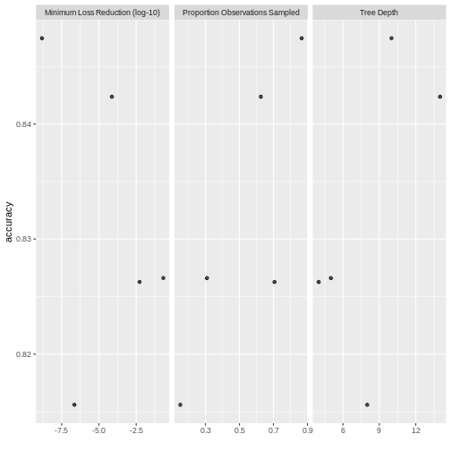

# RとMeCabによる自然言語処理（gibasa, textrecipes, XGBoost）

## この記事について

RからMeCabを利用して形態素解析するための自作パッケージの使用例です。

- [paithiov909/gibasa: An Alternate 'Rcpp' Interface to 'MeCab'](https://github.com/paithiov909/gibasa)

## データの準備

[livedoorニュースコーパス](https://www.rondhuit.com/download.html#ldcc)を使います。テキストの特徴量をもとに以下の9カテゴリの分類をします。

- トピックニュース
- Sports Watch
- ITライフハック
- 家電チャンネル
- MOVIE ENTER
- 独女通信
- エスマックス
- livedoor HOMME
- Peachy

[パーサを書いた](https://github.com/paithiov909/ldccr)ので、それでデータフレームにします。


```r
tbl <- ldccr::read_ldnws() |>
  dplyr::mutate(doc_id = as.character(dplyr::row_number()))
#> Done.
```

ここでは、未知語でない語で、かつ、名詞・形容詞・動詞である語についてのみ抽出し、IPA辞書に収録されている原形の分かち書きにします。


```r
corpus <- tbl |>
  dplyr::mutate(
    text = audubon::strj_normalize(body),
    chunk = dplyr::ntile(doc_id, 10)
  ) |>
  dplyr::group_by(chunk) |>
  dplyr::group_map(function(df, idx) {
    data.frame(
      doc_id = df$doc_id,
      text = df$text
    ) |>
      gibasa::tokenize(split = TRUE) |>
      gibasa::prettify(col_select = c("POS1", "Original")) |>
      dplyr::filter(
        POS1 %in% c("名詞", "形容詞", "動詞"),
        !is.na(Original)
      ) |>
      gibasa::pack(Original)
  }) |>
  purrr::map_dfr(~.) |>
  dplyr::left_join(dplyr::select(tbl, doc_id, category), by = "doc_id")
```

## モデルの学習

データを分割します。


```r
corpus_split <- rsample::initial_split(corpus, prop = .8, strata = "category")
corpus_train <- rsample::training(corpus_split)
corpus_test <- rsample::testing(corpus_split)
```

以下のレシピとモデルで学習します。ここでは、ハッシュトリックを使っています。デフォルトだとパラメータは[ここに書かれている感じ](https://parsnip.tidymodels.org/reference/boost_tree.html)になります。

なお、tidymodelsの枠組みの外であらかじめ分かち書きを済ませましたが、`textrecipes::step_tokenize`の`custom_token`引数に独自にトークナイザを指定することで、一つのstepとして分かち書きすることもできます。


```r
corpus_spec <-
  parsnip::boost_tree(
    sample_size = tune::tune(),
    loss_reduction = tune::tune(),
    tree_depth = tune::tune()
  ) |>
  parsnip::set_engine("xgboost") |>
  parsnip::set_mode("classification")

space_tokenizer <- function(x) {
  strsplit(x, " +")
}

corpus_rec <-
  recipes::recipe(
    category ~ text,
    data = corpus_train
  ) |>
  textrecipes::step_tokenize(text, custom_token = space_tokenizer) |>
  textrecipes::step_tokenfilter(text, min_times = 30L, max_tokens = 200L) |>
  textrecipes::step_texthash(text, num_terms = 200L)
```


```r
corpus_wflow <-
  workflows::workflow() %>%
  workflows::add_model(corpus_spec) %>%
  workflows::add_recipe(corpus_rec)
```

F値をメトリクスにして学習します。3分割CVで、簡単にですが、ハイパーパラメータ探索をします。


```r
# doParallel::registerDoParallel(cores = parallel::detectCores() - 1)

corpus_tune_res <-
  corpus_wflow |>
  tune::tune_grid(
    resamples = rsample::vfold_cv(corpus_train, v = 3L),
    grid = dials::grid_latin_hypercube(
      dials::sample_prop(),
      dials::loss_reduction(),
      dials::tree_depth(),
      size = 5L
    ),
    metrics = yardstick::metric_set(yardstick::f_meas),
    control = tune::control_grid(save_pred = TRUE)
  )

# doParallel::stopImplicitCluster()
```

ハイパラ探索の要約を確認します。


```r
ggplot2::autoplot(corpus_tune_res)
```



`fit`します。


```r
corpus_wflow <-
  tune::finalize_workflow(corpus_wflow, tune::select_best(corpus_tune_res, metric = "f_meas"))

corpus_fit <- parsnip::fit(corpus_wflow, corpus_train)
```

学習したモデルの精度を見てみます。


```r
dplyr::select(corpus_test, category) |>
  dplyr::bind_cols(predict(corpus_fit, corpus_test)) |>
  yardstick::f_meas(truth = category, estimate = .pred_class)
#> # A tibble: 1 × 3
#>   .metric .estimator .estimate
#>   <chr>   <chr>          <dbl>
#> 1 f_meas  macro          0.844
```

## 所感

このコーパスのカテゴリ分類はかなり易しいタスクであることが知られている（というか、一部のカテゴリではそのカテゴリを同定できる単語が本文に含まれてしまっている）ので相性もあるのでしょうが、簡単に機械学習できる点は気持ちよいです。

## セッション情報


```r
sessioninfo::session_info()
#> ─ Session info ─────────────────────────────────────────────────────────────────────────
#>  setting  value
#>  version  R version 4.1.3 (2022-03-10)
#>  os       Debian GNU/Linux 11 (bullseye)
#>  system   x86_64, linux-gnu
#>  ui       RStudio
#>  language (EN)
#>  collate  ja_JP.UTF-8
#>  ctype    ja_JP.UTF-8
#>  tz       Asia/Tokyo
#>  date     2022-04-29
#>  rstudio  1.4.1717 Juliet Rose (server)
#>  pandoc   2.11.4 @ /usr/lib/rstudio-server/bin/pandoc/ (via rmarkdown)
#>
#> ─ Packages ─────────────────────────────────────────────────────────────────────────────
#>  package      * version    date (UTC) lib source
#>  assertthat     0.2.1      2019-03-21 [1] CRAN (R 4.1.3)
#>  audubon        0.1.2.9000 2022-04-16 [1] https://paithiov909.r-universe.dev (R 4.1.3)
#>  backports      1.4.1      2021-12-13 [1] CRAN (R 4.1.3)
#>  base64enc      0.1-3      2015-07-28 [1] CRAN (R 4.1.3)
#>  BBmisc         1.12       2022-03-10 [1] RSPM (R 4.1.0)
#>  bit            4.0.4      2020-08-04 [1] CRAN (R 4.1.3)
#>  bit64          4.0.5      2020-08-30 [1] CRAN (R 4.1.3)
#>  broom        * 0.8.0      2022-04-13 [1] RSPM (R 4.1.0)
#>  bslib          0.3.1      2021-10-06 [1] CRAN (R 4.1.3)
#>  cachem         1.0.6      2021-08-19 [1] CRAN (R 4.1.3)
#>  checkmate      2.1.0      2022-04-21 [1] RSPM (R 4.1.0)
#>  class          7.3-20     2022-01-13 [4] CRAN (R 4.1.3)
#>  cli            3.2.0      2022-02-14 [1] CRAN (R 4.1.3)
#>  codetools      0.2-18     2020-11-04 [4] CRAN (R 4.0.3)
#>  colorspace     2.0-3      2022-02-21 [1] CRAN (R 4.1.3)
#>  conflicted     1.1.0      2021-11-26 [1] RSPM (R 4.1.3)
#>  crayon         1.5.1      2022-03-26 [1] CRAN (R 4.1.3)
#>  curl           4.3.2      2021-06-23 [1] CRAN (R 4.1.3)
#>  data.table     1.14.2     2021-09-27 [1] CRAN (R 4.1.3)
#>  DBI            1.1.2      2021-12-20 [1] CRAN (R 4.1.3)
#>  dials        * 0.1.1      2022-04-06 [1] RSPM (R 4.1.3)
#>  DiceDesign     1.9        2021-02-13 [1] RSPM (R 4.1.3)
#>  digest         0.6.29     2021-12-01 [1] CRAN (R 4.1.3)
#>  doParallel     1.0.17     2022-02-07 [1] RSPM (R 4.1.0)
#>  dplyr        * 1.0.8      2022-02-08 [1] CRAN (R 4.1.3)
#>  ellipsis       0.3.2      2021-04-29 [1] CRAN (R 4.1.3)
#>  embed          0.2.0      2022-04-13 [1] RSPM (R 4.1.0)
#>  evaluate       0.15       2022-02-18 [1] CRAN (R 4.1.3)
#>  fansi          1.0.3      2022-03-24 [1] CRAN (R 4.1.3)
#>  farver         2.1.0      2021-02-28 [1] CRAN (R 4.1.3)
#>  fastmap        1.1.0      2021-01-25 [1] CRAN (R 4.1.3)
#>  fastmatch      1.1-3      2021-07-23 [1] CRAN (R 4.1.3)
#>  float          0.3-0      2022-04-07 [1] RSPM (R 4.1.0)
#>  FNN            1.1.3      2019-02-15 [1] RSPM (R 4.1.0)
#>  foreach        1.5.2      2022-02-02 [1] CRAN (R 4.1.3)
#>  fs             1.5.2      2021-12-08 [1] CRAN (R 4.1.3)
#>  furrr          0.2.3      2021-06-25 [1] RSPM (R 4.1.3)
#>  future         1.24.0     2022-02-19 [1] CRAN (R 4.1.3)
#>  future.apply   1.8.1      2021-08-10 [1] CRAN (R 4.1.3)
#>  generics       0.1.2      2022-01-31 [1] CRAN (R 4.1.3)
#>  ggplot2      * 3.3.5      2021-06-25 [1] CRAN (R 4.1.3)
#>  gibasa         0.3.0      2022-04-15 [1] Github (paithiov909/gibasa@2186e0a)
#>  globals        0.14.0     2020-11-22 [1] CRAN (R 4.1.3)
#>  glue           1.6.2      2022-02-24 [1] CRAN (R 4.1.3)
#>  gower          1.0.0      2022-02-03 [1] RSPM (R 4.1.3)
#>  GPfit          1.0-8      2019-02-08 [1] RSPM (R 4.1.3)
#>  gtable         0.3.0      2019-03-25 [1] CRAN (R 4.1.3)
#>  hardhat        0.2.0      2022-01-24 [1] RSPM (R 4.1.3)
#>  highr          0.9        2021-04-16 [1] CRAN (R 4.1.3)
#>  hms            1.1.1      2021-09-26 [1] CRAN (R 4.1.3)
#>  htmltools      0.5.2      2021-08-25 [1] CRAN (R 4.1.3)
#>  httpgd         1.3.0      2022-02-02 [1] CRAN (R 4.1.3)
#>  infer        * 1.0.0      2021-08-13 [1] RSPM (R 4.1.3)
#>  ipred          0.9-12     2021-09-15 [1] RSPM (R 4.1.3)
#>  iterators      1.0.14     2022-02-05 [1] CRAN (R 4.1.3)
#>  jquerylib      0.1.4      2021-04-26 [1] CRAN (R 4.1.3)
#>  jsonlite       1.8.0      2022-02-22 [1] CRAN (R 4.1.3)
#>  keras          2.8.0      2022-02-10 [1] RSPM (R 4.1.0)
#>  knitr          1.38       2022-03-25 [1] CRAN (R 4.1.3)
#>  labeling       0.4.2      2020-10-20 [1] CRAN (R 4.1.3)
#>  later          1.3.0      2021-08-18 [1] CRAN (R 4.1.3)
#>  lattice        0.20-45    2021-09-22 [4] CRAN (R 4.1.3)
#>  lava           1.6.10     2021-09-02 [1] RSPM (R 4.1.3)
#>  ldccr          0.0.7      2022-04-12 [1] https://paithiov909.r-universe.dev (R 4.1.3)
#>  lgr            0.4.3      2021-09-16 [1] RSPM (R 4.1.0)
#>  lhs            1.1.5      2022-03-22 [1] RSPM (R 4.1.3)
#>  lifecycle      1.0.1      2021-09-24 [1] CRAN (R 4.1.3)
#>  listenv        0.8.0      2019-12-05 [1] CRAN (R 4.1.3)
#>  lubridate      1.8.0      2021-10-07 [1] CRAN (R 4.1.3)
#>  magrittr       2.0.3      2022-03-30 [1] CRAN (R 4.1.3)
#>  MASS           7.3-55     2022-01-13 [4] CRAN (R 4.1.3)
#>  Matrix         1.4-0      2021-12-08 [4] CRAN (R 4.1.3)
#>  memoise        2.0.1      2021-11-26 [1] CRAN (R 4.1.3)
#>  mlapi          0.1.0      2017-12-17 [1] RSPM (R 4.1.0)
#>  mlr            2.19.0     2021-02-22 [1] RSPM (R 4.1.0)
#>  modeldata    * 0.1.1      2021-07-14 [1] RSPM (R 4.1.3)
#>  munsell        0.5.0      2018-06-12 [1] CRAN (R 4.1.3)
#>  nnet           7.3-17     2022-01-13 [4] CRAN (R 4.1.3)
#>  parallelly     1.31.0     2022-04-07 [1] RSPM (R 4.1.0)
#>  parallelMap    1.5.1      2021-06-28 [1] RSPM (R 4.1.0)
#>  ParamHelpers   1.14       2020-03-24 [1] RSPM (R 4.1.0)
#>  parsnip      * 0.2.1      2022-03-17 [1] RSPM (R 4.1.3)
#>  pillar         1.7.0      2022-02-01 [1] CRAN (R 4.1.3)
#>  pins           1.0.1      2021-12-15 [1] RSPM (R 4.1.0)
#>  pkgconfig      2.0.3      2019-09-22 [1] CRAN (R 4.1.3)
#>  plyr           1.8.7      2022-03-24 [1] RSPM (R 4.1.3)
#>  png            0.1-7      2013-12-03 [1] CRAN (R 4.1.3)
#>  pROC           1.18.0     2021-09-03 [1] RSPM (R 4.1.3)
#>  prodlim        2019.11.13 2019-11-17 [1] RSPM (R 4.1.3)
#>  purrr        * 0.3.4      2020-04-17 [1] CRAN (R 4.1.3)
#>  quanteda       3.2.1      2022-03-01 [1] CRAN (R 4.1.3)
#>  R.cache        0.15.0     2021-04-30 [1] CRAN (R 4.1.3)
#>  R.methodsS3    1.8.1      2020-08-26 [1] CRAN (R 4.1.3)
#>  R.oo           1.24.0     2020-08-26 [1] CRAN (R 4.1.3)
#>  R.utils        2.11.0     2021-09-26 [1] CRAN (R 4.1.3)
#>  R6             2.5.1      2021-08-19 [1] CRAN (R 4.1.3)
#>  RANN           2.6.1      2019-01-08 [1] RSPM (R 4.1.0)
#>  rappdirs       0.3.3      2021-01-31 [1] CRAN (R 4.1.3)
#>  Rcpp           1.0.8.3    2022-03-17 [1] CRAN (R 4.1.3)
#>  RcppParallel   5.1.5      2022-01-05 [1] CRAN (R 4.1.3)
#>  readr          2.1.2      2022-01-30 [1] CRAN (R 4.1.3)
#>  recipes      * 0.2.0      2022-02-18 [1] RSPM (R 4.1.3)
#>  rematch2       2.1.2      2020-05-01 [1] CRAN (R 4.1.3)
#>  reticulate     1.24       2022-01-26 [1] RSPM (R 4.1.0)
#>  RhpcBLASctl    0.21-247.1 2021-11-05 [1] RSPM (R 4.1.0)
#>  rlang          1.0.2      2022-03-04 [1] CRAN (R 4.1.3)
#>  rmarkdown      2.13       2022-03-10 [1] CRAN (R 4.1.3)
#>  ROSE           0.0-4      2021-06-14 [1] RSPM (R 4.1.0)
#>  rpart          4.1.16     2022-01-24 [4] CRAN (R 4.1.3)
#>  rsample      * 0.1.1      2021-11-08 [1] RSPM (R 4.1.3)
#>  rsparse        0.5.0      2021-11-30 [1] RSPM (R 4.1.0)
#>  rstudioapi     0.13       2020-11-12 [1] CRAN (R 4.1.3)
#>  sass           0.4.1      2022-03-23 [1] CRAN (R 4.1.3)
#>  scales       * 1.2.0      2022-04-13 [1] RSPM (R 4.1.0)
#>  sessioninfo    1.2.2      2021-12-06 [1] RSPM (R 4.1.0)
#>  stopwords      2.3        2021-10-28 [1] CRAN (R 4.1.3)
#>  stringi        1.7.6      2021-11-29 [1] CRAN (R 4.1.3)
#>  stringr        1.4.0      2019-02-10 [1] CRAN (R 4.1.3)
#>  styler         1.7.0      2022-03-13 [1] CRAN (R 4.1.3)
#>  survival       3.3-1      2022-03-03 [4] CRAN (R 4.1.3)
#>  systemfonts    1.0.4      2022-02-11 [1] CRAN (R 4.1.3)
#>  tensorflow     2.8.0      2022-02-09 [1] RSPM (R 4.1.0)
#>  text2vec     * 0.6.1      2022-04-21 [1] RSPM (R 4.1.0)
#>  textrecipes  * 0.5.1      2022-03-29 [1] RSPM (R 4.1.3)
#>  tfruns         1.5.0      2021-02-26 [1] RSPM (R 4.1.0)
#>  themis         0.2.1      2022-04-13 [1] RSPM (R 4.1.0)
#>  tibble       * 3.1.6      2021-11-07 [1] CRAN (R 4.1.3)
#>  tidymodels   * 0.2.0      2022-03-19 [1] RSPM (R 4.1.3)
#>  tidyr        * 1.2.0      2022-02-01 [1] CRAN (R 4.1.3)
#>  tidyselect     1.1.2      2022-02-21 [1] CRAN (R 4.1.3)
#>  timeDate       3043.102   2018-02-21 [1] RSPM (R 4.1.3)
#>  tune         * 0.2.0      2022-03-19 [1] RSPM (R 4.1.3)
#>  tzdb           0.3.0      2022-03-28 [1] CRAN (R 4.1.3)
#>  unbalanced     2.0        2015-06-26 [1] RSPM (R 4.1.0)
#>  utf8           1.2.2      2021-07-24 [1] CRAN (R 4.1.3)
#>  uwot           0.1.11     2021-12-02 [1] RSPM (R 4.1.0)
#>  V8             4.1.0      2022-02-06 [1] CRAN (R 4.1.3)
#>  vctrs          0.4.1      2022-04-13 [1] RSPM (R 4.1.0)
#>  vroom          1.5.7      2021-11-30 [1] CRAN (R 4.1.3)
#>  whisker        0.4        2019-08-28 [1] CRAN (R 4.1.3)
#>  withr          2.5.0      2022-03-03 [1] CRAN (R 4.1.3)
#>  workflows    * 0.2.6      2022-03-18 [1] RSPM (R 4.1.3)
#>  workflowsets * 0.2.1      2022-03-15 [1] RSPM (R 4.1.3)
#>  xfun           0.30       2022-03-02 [1] CRAN (R 4.1.3)
#>  xgboost      * 1.6.0.1    2022-04-16 [1] RSPM (R 4.1.0)
#>  yaml           2.3.5      2022-02-21 [1] RSPM (R 4.1.0)
#>  yardstick    * 0.0.9      2021-11-22 [1] RSPM (R 4.1.3)
#>  zeallot        0.1.0      2018-01-28 [1] RSPM (R 4.1.0)
#>
#>  [1] /home/paithiov909/R/x86_64-pc-linux-gnu-library/4.1
#>  [2] /usr/local/lib/R/site-library
#>  [3] /usr/lib/R/site-library
#>  [4] /usr/lib/R/library
#>
#> ────────────────────────────────────────────────────────────────────────────────────────
```
